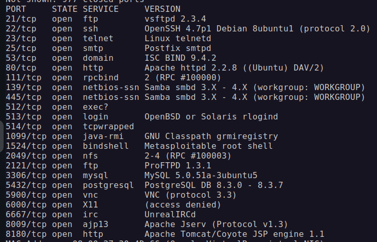
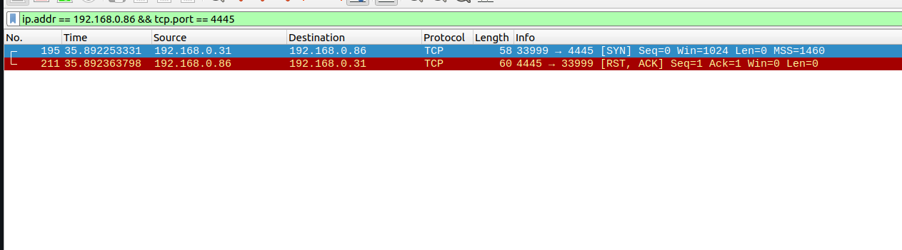
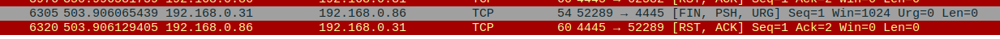
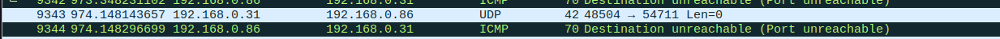

# Домашнее задание к занятию «Уязвимости и атаки на информационные системы»

### Задание 1

Скачайте и установите виртуальную машину Metasploitable: https://sourceforge.net/projects/metasploitable/.

Это типовая ОС для экспериментов в области информационной безопасности, с которой следует начать при анализе уязвимостей.

Просканируйте эту виртуальную машину, используя **nmap**.

Попробуйте найти уязвимости, которым подвержена эта виртуальная машина.

Сами уязвимости можно поискать на сайте https://www.exploit-db.com/.

Для этого нужно в поиске ввести название сетевой службы, обнаруженной на атакуемой машине, и выбрать подходящие по версии уязвимости.

Ответьте на следующие вопросы:

- Какие сетевые службы в ней разрешены?
- Какие уязвимости были вами обнаружены? (список со ссылками: достаточно трёх уязвимостей)
  
*Приведите ответ в свободной форме.*  

### Решение:

Какие уязвимости были вами обнаружены? (список со ссылками: достаточно трёх уязвимостей)

1. Pachev FTP Server 1.0 - Path Traversal
[1](https://www.exploit-db.com/exploits/47956)

2. OpenSSH < 7.4 - agent Protocol Arbitrary Library Loading
[2](https://www.exploit-db.com/exploits/40963)

3. Polycom HDX - Telnet Authentication Bypass (Metasploit)
[3](https://www.exploit-db.com/exploits/24494)

### Задание 2

Проведите сканирование Metasploitable в режимах SYN, FIN, Xmas, UDP.

Запишите сеансы сканирования в Wireshark.

Ответьте на следующие вопросы:

- Чем отличаются эти режимы сканирования с точки зрения сетевого трафика?
- Как отвечает сервер?

*Приведите ответ в свободной форме.*

### Решение:

1. SYN
sudo nmap -sS 192.168.0.86

Только флаг SYN
Сканер отправляет запрос с флагом SYN, как будто пытается установить соединение, но не завершает трехстадийное рукопожатие. Сервер отвечает SYN-ACK, если порт открыт, или RST, если закрыт.
Это сканирование нацелено на минимизацию установления соединений, что делает его быстрым и невидимым для большинства систем обнаружения вторжений (IDS).

2. FIN
sudo nmap -sF 192.168.0.86

Только флаг FIN
Сканер отправляет пакет с флагом FIN, который обычно используется для завершения соединения. Порты, которые закрыты, отвечают RST, а открытые могут не ответить.
Использование флага FIN делает это сканирование необычным. Он предназначен для завершения соединений, и закрытые порты сразу посылают RST. Однако для открытых портов сервер может не отреагировать вообще, что указывает на их доступность.

3. Xmas
sudo nmap -sX 192.168.0.86

Флаги FIN, URG и PUSH
Пакет с таким набором флагов является очень нестандартным и часто вызывает отклики только от закрытых портов, которые отвечают RST. Открытые порты могут вообще не ответить.
Этот метод использует комбинированный и необычный набор флагов, который помогает скрыть сканирование, но также может привести к различным откликам в зависимости от операционной системы на сервере.

4. UDP Сканирование
sudo nmap -sU 192.168.0.86

Отсутствие флагов TCP, работает на уровне UDP.
это безустановочный протокол, и сканирование здесь основывается на отправке пакетов на порты. Если порт открыт, сервер не отвечает, а если закрыт — возвращается ICMP сообщение "port unreachable".
UDP сканирование не использует TCP-соединений и не требует флагов, как в других методах. Это делает его пригодным для сканирования UDP-портов, которые не могут быть проверены с помощью SYN или FIN сканирования.